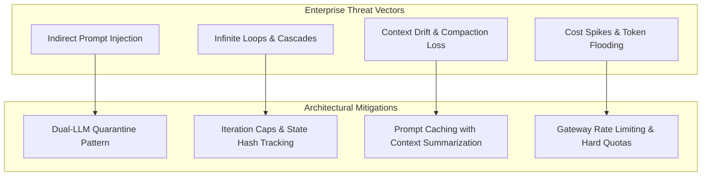

# Enterprise Use Case 4: Enterprise Failure Modes & Mitigation Strategies

> [🔙 Back to Senior Transition Guide](../senior-transition-guide.md)

---

## Architectural Context
Autonomous execution introduces failure modes that do not exist in traditional software: infinite reasoning loops, tool-calling cascades, indirect prompt injection via retrieved content, and context drift. These require active detection, isolation, and blast radius management.

---

## Failure Mode & Defense Matrix

| Failure Mode | Mechanism | Enterprise Impact | Architectural Mitigation |
|:---|:---|:---|:---|
| **Indirect Prompt Injection** | Malicious instructions embedded in untrusted retrieved documents (PDFs, emails, web pages). | Data exfiltration, unauthorized tool operations. | **Dual-LLM Quarantine**: Parse untrusted inputs with an unprivileged model with no tool access; pass validated schemas to controller. |
| **Infinite Reasoning Loops** | Model repeats failed actions or oscillates between competing sub-goals. | High compute bills, thread exhaustion. | **Deterministic Execution Budgets**: Enforce max iteration count (e.g. 5–8 steps), loop detection via state hashing, and timeouts. |
| **Tool-Calling Cascades** | Output errors from one tool trigger recursive invocations across downstream APIs. | Microservice overload, unintended state changes. | **Idempotent APIs & Circuit Breakers**: All tool actions must be idempotent; wrap tool clients with circuit breakers. |
| **Context Drift & Lost-in-the-Middle** | Long multi-turn conversations dilute initial system directives. | Model ignores original instructions and business rules. | **Context Compaction**: Periodically summarize past conversation turns while pinning static system instructions at the prompt root. |
| **Unbounded Token Consumption** | Verbose reasoning or oversized tool payloads generate massive token volume. | Budget overruns, unexpected cloud bills. | **Gateway Quotas**: Real-time token metering and per-tenant daily token limits. |
| **Sycophancy & Hallucination** | Model invents data or fabricates API parameters to appear compliant. | Corrupted state, broken downstream workflows. | **Strict Output Schemas & NLI Checks**: Reject tool arguments failing Pydantic/Zod validation; verify citations with NLI models. |
