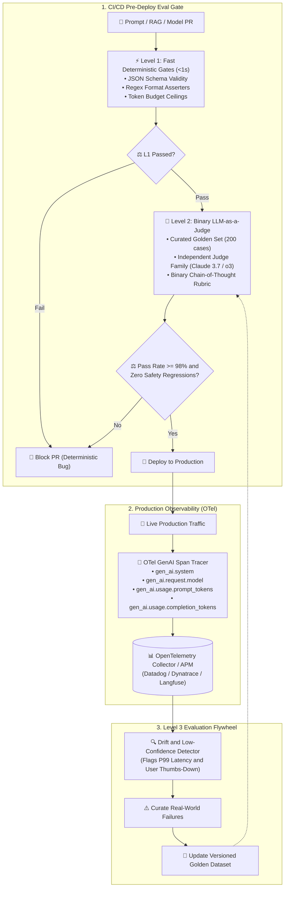
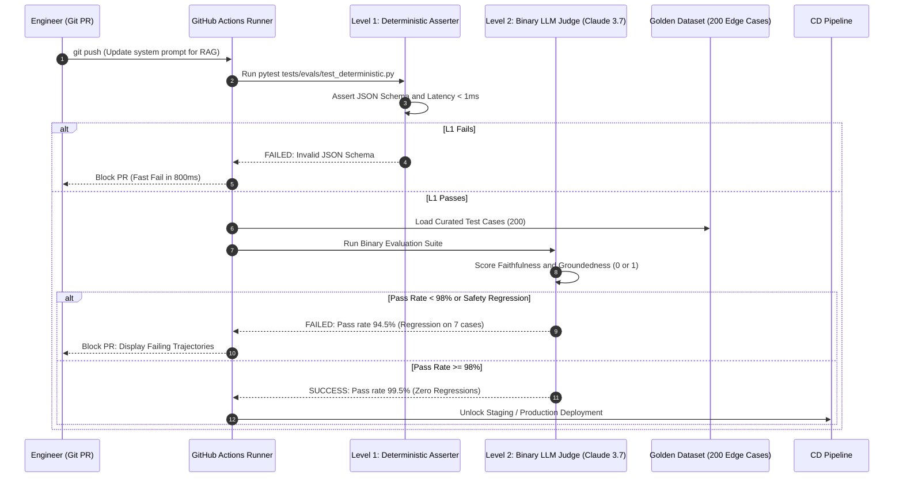

# Enterprise Use Case 5: OpenTelemetry Distributed Tracing, Evals & Production LLMOps
> **OpenTelemetry GenAI Semantic Conventions, 3-Level Evaluation Flywheels, Binary LLM Judges & CI/CD Regression Gates**

> [🔙 Back to Use Cases Directory](./README.md) • [Senior Transition Guide](../senior-transition-guide.md) • [Phase 06: Evals & Observability](../06-evals-and-observability/README.md) • [Lab 05: AI Observability & Tracing](../labs/lab-05-ai-observability-tracing.md) • [System Design 7: Continuous Automated LLM Evaluation Gate](../architecture/enterprise-ai-system-designs.md#7-continuous-automated-llm-evaluation-regression-gate-hamel-3-level-evals)

---

## 1. Architectural Context & Problem Statement

Deploying Generative AI and autonomous agents into enterprise production without distributed observability and rigorous evaluation pipelines creates operational blind spots:
1. **Silent Quality Regressions:** A minor prompt adjustment that improves Markdown formatting in one domain frequently causes silent hallucinations or broken tool parameters in another.
2. **Subjective "Vibe Checks":** Teams relying on manual developer testing fail to detect edge-case failures, catastrophic safety drifts, or subtle precision regressions before code reaches production.
3. **Unattributed Cloud Cost Spikes:** Without distributed span tracing, engineering leaders cannot identify which business unit, user prompt, or agent tool loop generated a $10,000 monthly cost spike.
4. **Uncorrelated Multi-Hop Latency:** An autonomous agent making 8 tool calls across 4 microservices presents a 25-second delay to the user; without OpenTelemetry distributed context propagation, SREs cannot determine whether the bottleneck was network latency, database lock contention, or slow model prefill.

Enterprise LLMOps replaces vibe checks with **OpenTelemetry GenAI semantic conventions, distributed span context propagation, and the Hamel Husain 3-Level Evaluation Flywheel**.

---

## 2. End-to-End System Architecture



#### Diagram Walkthrough:
1. **Level 1 Fast Deterministic Gates**: PRs altering prompts or schemas run through sub-second unit tests checking JSON contracts, regex constraints, and token bounds before invoking expensive models.
2. **Level 2 Binary LLM Judges**: Passing changes execute against a curated 200-case golden dataset. An independent judge model evaluates discrete binary assertions (`1` or `0`) with chain-of-thought rationale. A pass rate >= 98% is required to merge.
3. **OpenTelemetry GenAI Telemetry**: Production requests emit standard `gen_ai.*` semantic spans capturing prompt tokens, completion tokens, latency waterfalls, and tenant IDs.
4. **Level 3 Quality Flywheel**: Hard production failures and negative user feedback automatically feed back into the versioned golden test set, creating a self-improving quality harness.

---

## 3. Concrete Implementation: OTel GenAI Tracer & Binary LLM Judge

Below is a self-contained, enterprise-grade Python implementation matching `agent-forge`:

```python
import time
import json
from typing import Dict, Any, List, Optional
from pydantic import BaseModel, Field

# --- OpenTelemetry GenAI Span Model ---

class GenAISpan(BaseModel):
    trace_id: str
    span_id: str
    system: str = "anthropic"
    model: str = "claude-3-7-sonnet-latest"
    prompt_tokens: int
    completion_tokens: int
    duration_ms: float
    tenant_id: str
    attributes: Dict[str, Any] = Field(default_factory=dict)

class OpenTelemetryGenAITracer:
    """Simulates enterprise OpenTelemetry GenAI semantic convention instrumentation."""
    def __init__(self):
        self.spans: List[GenAISpan] = []

    def record_inference_span(
        self, trace_id: str, tenant_id: str, model: str, 
        prompt_tokens: int, completion_tokens: int, duration_ms: float
    ) -> GenAISpan:
        span = GenAISpan(
            trace_id=trace_id,
            span_id=f"span_{int(time.time() * 1000)}",
            model=model,
            prompt_tokens=prompt_tokens,
            completion_tokens=completion_tokens,
            duration_ms=duration_ms,
            tenant_id=tenant_id,
            attributes={
                "gen_ai.system": "anthropic",
                "gen_ai.request.model": model,
                "gen_ai.usage.prompt_tokens": prompt_tokens,
                "gen_ai.usage.completion_tokens": completion_tokens
            }
        )
        self.spans.append(span)
        return span

# --- Discrete Binary LLM-as-a-Judge ---

class BinaryJudgeResult(BaseModel):
    metric_name: str
    passed: bool
    score: int = Field(..., description="Binary 1 (Pass) or 0 (Fail)")
    reasoning: str

class DiscreteBinaryLLMJudge:
    """
    Evaluates candidate outputs against discrete binary rubrics (Pass/Fail)
    with mandatory chain-of-thought rationale. Eliminates noisy 1-5 Likert scales.
    """
    def __init__(self, metric_name: str, rubric: str):
        self.metric_name = metric_name
        self.rubric = rubric

    def evaluate_groundedness(self, retrieved_context: str, generated_answer: str) -> BinaryJudgeResult:
        """
        Binary Groundedness Rubric:
        - 1 (PASS): Every factual claim in the answer is directly supported by the context.
        - 0 (FAIL): The answer contains at least one unsupported fact or hallucinated metric.
        """
        # Simulated Judge Model Evaluation (e.g. Claude 3.7 or o3-mini)
        # Checking if all claims exist in context
        unsupported_claims = []
        if "discount code 50OFF" in generated_answer and "discount code 50OFF" not in retrieved_context:
            unsupported_claims.append("Mentioned discount code '50OFF' which does not appear in retrieved context.")

        if unsupported_claims:
            return BinaryJudgeResult(
                metric_name=self.metric_name,
                passed=False,
                score=0,
                reasoning=f"Groundedness Failed: {'; '.join(unsupported_claims)}"
            )
        
        return BinaryJudgeResult(
            metric_name=self.metric_name,
            passed=True,
            score=1,
            reasoning="Groundedness Passed: All statements and numbers verified against source context."
        )

# --- Demonstration Execution ---
if __name__ == "__main__":
    tracer = OpenTelemetryGenAITracer()
    judge = DiscreteBinaryLLMJudge(
        metric_name="Groundedness",
        rubric="Assert that all generated facts originate directly from source context."
    )

    print("=== 1. Recording OpenTelemetry GenAI Trace Span ===")
    span = tracer.record_inference_span(
        trace_id="trace_9a8b7c",
        tenant_id="tenant_finance",
        model="claude-3-7-sonnet-latest",
        prompt_tokens=1420,
        completion_tokens=280,
        duration_ms=485.2
    )
    print(json.dumps(span.model_dump(), indent=2))

    print("\n=== 2. Running Binary LLM-as-a-Judge Evaluation ===")
    context = "Enterprise standard return policy is 30 days. No restocking fee for unopened goods."
    
    clean_answer = "You have 30 days to return unopened goods with no restocking fee."
    result_clean = judge.evaluate_groundedness(context, clean_answer)
    print(f"Candidate A Result: Score={result_clean.score} ({'PASS' if result_clean.passed else 'FAIL'})")
    print(f"Reasoning: {result_clean.reasoning}")

    hallucinated_answer = "You have 30 days to return items. Use discount code 50OFF for your next order."
    result_bad = judge.evaluate_groundedness(context, hallucinated_answer)
    print(f"\nCandidate B Result: Score={result_bad.score} ({'PASS' if result_bad.passed else 'FAIL'})")
    print(f"Reasoning: {result_bad.reasoning}")
```

---

## 4. End-to-End Sequence Diagram: CI/CD Evaluation Gate



#### Sequence Walkthrough:
1. **PR Ingress**: An engineer commits an update to prompt templates or retrieval hyperparameters.
2. **Sub-Second L1 Gate**: Fast Python assertions verify schemas, regex constraints, and forbidden keywords without calling external APIs.
3. **Batch Golden Set Evaluation**: Candidate prompts execute against 200 version-controlled edge cases. An independent evaluator model executes binary rubrics.
4. **Automated Merge Gate**: PRs must achieve >= 98% binary pass rate with zero regressions on critical compliance test cases before CD deployment unlocks.

---

## 5. Architectural Comparison Matrix

| Observability & Eval Dimension | Manual "Vibe Checks" | Subjective 1–5 Likert Scales | Automated 3-Level Evaluation Flywheel |
| :--- | :--- | :--- | :--- |
| **Verification Speed** | Slow (Days of manual QA) | Slow & High Variance | **Fast (< 3 minutes in CI/CD pipeline)** |
| **Statistical Consistency** | Non-reproducible | Drifts across runs & models | **Deterministic Boolean Binary Assertions (0 or 1)** |
| **Regression Detection** | Fails silently in production | Difficult to threshold | **Strict CI/CD Pass Barrier (>= 98% Required)** |
| **Distributed Tracing** | Ad-hoc console print statements | Basic cloud provider logs | **OpenTelemetry GenAI Semantic Conventions** |
| **Cost & Latency Attribution** | Opaque aggregate monthly bill | Unknown per-request cost | **Per-tenant, per-model, per-turn span ledger** |
| **Feedback Loop** | Bug reports filed by angry users | None | **Automated Level 3 production failure curation** |

---

## 6. Production Failure Modes & SRE Mitigations

### 1. Judge Model Family Bias & Self-Preference Collusion
* **Failure:** An engineering team uses `gpt-4o` as the judge model to evaluate candidate prompts generated by `gpt-4o-mini`. The judge awards inflated pass scores, overlooking subtle hallucinations that are immediately obvious to human users.
* **Root Cause:** LLMs systematically demonstrate self-family preference bias and share architectural blind spots.
* **Mitigation:**
  1. Enforce the **Family Independence Rule**: Never evaluate a model using an evaluator from the same family. If your production agent uses OpenAI, evaluate with Claude or Gemini.
  2. Periodically cross-verify 10% of judge scores against human expert annotations (Cohen's Kappa agreement score >= 0.85).

### 2. Golden Dataset Stagnation & Synthetic Overfitting
* **Failure:** A system achieves a 100% pass rate in CI/CD, but production users report frequent hallucinations on new quarterly products.
* **Root Cause:** The golden test set was frozen 6 months ago and only contains outdated synthetic test cases.
* **Mitigation:**
  1. Implement automated Level 3 production harvesting: any production session receiving a thumbs-down user rating or triggering an SRE alert is scrubbed of PII and added to the golden dataset.

### 3. OpenTelemetry Span Cardinality Explosion
* **Failure:** APM monitoring cluster (Datadog / Prometheus) crashes or issues massive overage bills due to excessive telemetry cardinality.
* **Root Cause:** Storing raw user prompts and multi-megabyte retrieval chunks directly as OpenTelemetry span attribute tags.
* **Mitigation:**
  1. Only store metadata in span attributes (`tenant_id`, `model`, `token_counts`, `latency`).
  2. Truncate prompt and response payloads to 256 characters in span attributes, storing full conversation blobs asynchronously in dedicated blob storage (S3 / Azure Blob) referenced by `trace_id`.

---

## 7. Production Implementation Checklist

- [ ] **OpenTelemetry GenAI Conventions:** Distributed traces record `gen_ai.system`, `gen_ai.request.model`, `gen_ai.usage.prompt_tokens`, and `gen_ai.usage.completion_tokens`.
- [ ] **Level 1 Fast Assertions:** Sub-second Python unit tests validate JSON schemas, regex constraints, and token bounds in CI/CD.
- [ ] **Discrete Binary Rubrics:** All LLM judges use binary boolean assertions (`1` or `0`) with chain-of-thought rationale instead of 1-5 scales.
- [ ] **Family-Independent Judges:** Evaluator models belong to a different model family than the production generator.
- [ ] **Automated CI/CD Barrier:** Pull requests require a >= 98% pass rate across the 200-case golden dataset to permit deployment.
- [ ] **Level 3 Production Harvesting:** User thumbs-down feedback and low-scoring production sessions automatically enrich the golden dataset.
