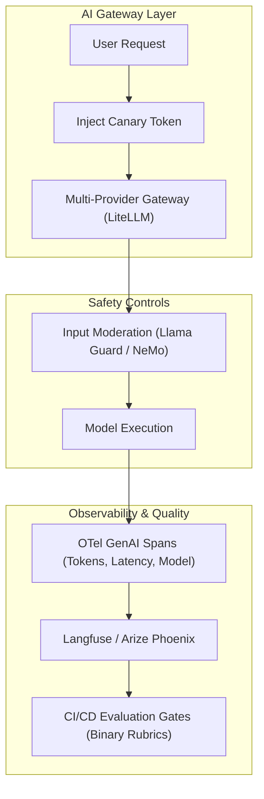

# Enterprise Use Case 5: OpenTelemetry, Evals & Production LLMOps

> [🔙 Back to Senior Transition Guide](../senior-transition-guide.md)

---

## Architectural Context
Production LLMOps shifts quality control from subjective human "vibe checks" to automated, continuous evaluation harnesses and standardized distributed tracing using OpenTelemetry.

---

## Key Architecture Components

### 1. OpenTelemetry GenAI Semantic Conventions
- Standardized span attributes: `gen_ai.system`, `gen_ai.request.model`, `gen_ai.usage.prompt_tokens`, `gen_ai.usage.completion_tokens`.
- Propagates trace contexts across distributed microservices and LLM provider calls for end-to-end distributed waterfall diagnostics.

### 2. Discrete Binary Evaluations
- Replaces subjective 1-to-5 Likert scales with deterministic binary assertions (Pass/Fail) evaluated across curated golden datasets.
- Runs automatically in CI/CD pull request gates before deploying any prompt, configuration, or model update.

### 3. Dual-LLM Privilege Separation
- An unprivileged model parses raw, untrusted external inputs into a structured schema without access to tools or external APIs.
- A privileged controller model executes actions based exclusively on the sanitized structured data.

### 4. Cryptographic Canary Tokens
- High-entropy UUIDs injected into system instructions; gateway egress filters terminate the response and trigger security alerts if the canary is leaked in model output.
