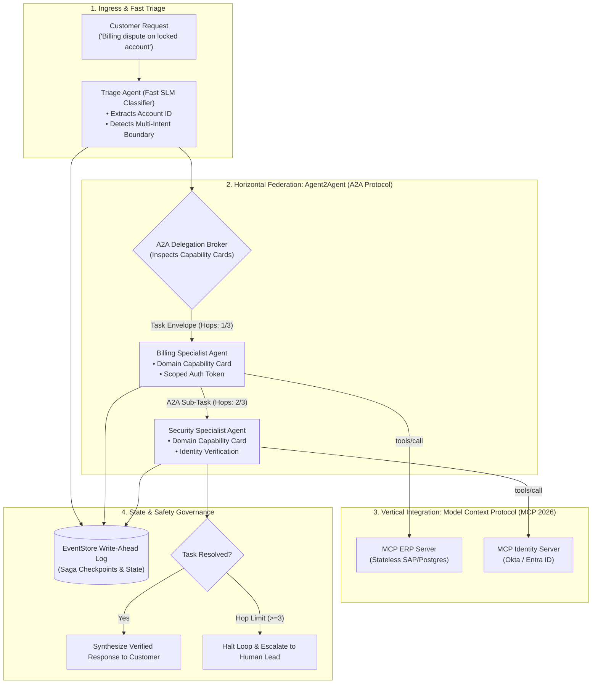
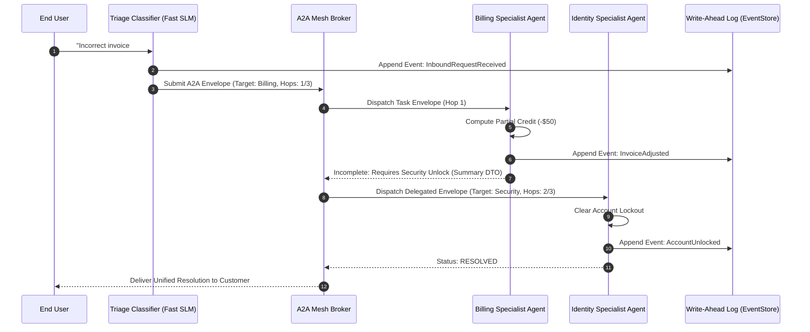

# Enterprise Use Case 6: Agent-to-Agent (A2A) Protocols & Swarm Orchestration
> **Google A2A Open Protocol, Autonomous Agent Capability Cards, Task Envelopes, Loop Circuit Breakers & Saga Compensations**

> [🔙 Back to Use Cases Directory](./README.md) • [Senior Transition Guide](../senior-transition-guide.md) • [Phase 04: Agentic Systems](../04-agentic-systems-and-orchestration/README.md) • [System Design 5: Customer Operations Peer Swarm](../architecture/enterprise-ai-system-designs.md#5-omnichannel-customer-operations-triage-peer-swarm-a2a-mcp) • [ADR-005: A2A vs MCP Boundary](../architecture/adrs/ADR-005-agent-to-agent-a2a-vs-model-context-protocol-mcp.md)

---

## 1. Architectural Context & Problem Statement

Monolithic AI agents that attempt to handle all corporate workflows inside a single prompt-response loop suffer from prompt bloat, high token consumption, slow execution, and conflicting instructions. To scale across enterprise divisions (Finance, Legal, Engineering, Customer Operations), systems engineering must decompose capabilities into **autonomous, interoperable micro-agents**.

However, orchestrating multi-agent systems without formal communication protocols introduces critical failures:
1. **Cyclic Handoff Deadlocks (The Infinite Ping-Pong):** Agent A transfers a task to Agent B, which transfers it back to Agent A, burning thousands of dollars in minutes (as documented in [`INCIDENT-003`](../architecture/post-mortems/INCIDENT-003-multi-agent-cyclic-handoff-deadlock.md)).
2. **Context Dilution & Memory Rot:** Passing entire raw multi-turn conversation histories across agent hops saturates context windows and corrupts reasoning.
3. **Identity Spoofing & Escalation:** An unprivileged customer-facing agent delegating tasks to an internal financial ledger agent without cryptographic scope attestation risks unauthorized privilege escalation.
4. **Tool vs. Agent Confusion:** Attempting to use conversational swarms for deterministic database queries adds seconds of unnecessary latency.

To address these challenges, enterprise architectures adopt the **Google Agent2Agent (A2A) open protocol standard (governed by the Linux Foundation Agentic AI Foundation)**, utilizing immutable **Agent Capability Cards, structured Task Envelopes with strict hop bounds, and Saga transaction compensation**.

---

## 2. End-to-End System Architecture



#### Diagram Walkthrough:
1. **Ingress & Fast Triage**: Customer queries enter via a lightweight SLM classifier (Gemini 2.5 Flash / Claude 3.5 Haiku) that identifies domain intents without holding mutating credentials.
2. **Horizontal A2A Task Delegation**: The broker evaluates the target agents' published Capability Cards and dispatches a structured A2A Task Envelope containing verified state, credentials, and an immutable hop counter.
3. **Vertical Tool Execution via MCP**: Each specialist agent accesses domain-specific enterprise data via stateless Model Context Protocol JSON-RPC servers.
4. **State Persistence & Loop Circuit Breakers**: All agent state transitions are journaled to an event-sourced Write-Ahead Log. If the hop counter reaches 3 without resolution, execution terminates immediately to prevent cyclic deadlocks.

---

## 3. Concrete Implementation: A2A Task Router & Capability Card Engine

Below is a self-contained Python implementation demonstrating:
- **Agent Capability Card declarations conforming to A2A schema standards**
- **Structured A2A Task Envelope serialization with bounded hop counters**
- **Cycle-detection circuit breaker**
- **Context compression (preventing context rot across handoffs)**

```python
import json
import uuid
import logging
from typing import Dict, Any, List, Optional
from pydantic import BaseModel, Field

logging.basicConfig(level=logging.INFO)
logger = logging.getLogger("A2A_Mesh")

# --- A2A Protocol Schemas ---

class AgentCapabilityCard(BaseModel):
    agent_id: str
    name: str
    organization: str
    supported_task_types: List[str]
    required_scopes: List[str]
    max_execution_seconds: int = 30

class A2ATaskEnvelope(BaseModel):
    task_id: str = Field(default_factory=lambda: f"task_{uuid.uuid4().hex[:8]}")
    origin_agent_id: str
    target_agent_id: str
    task_type: str
    task_state_summary: str = Field(..., description="Compressed context DTO (max 400 tokens)")
    hop_count: int = Field(default=1, description="Incremented on every agent-to-agent hop")
    max_hops: int = Field(default=3, description="Hard ceiling preventing cyclic deadlocks")
    caller_auth_token: str

class CyclicDeadlockException(Exception):
    """Raised when an A2A task reaches maximum permissible delegation hops."""
    pass

# --- Autonomous Specialist Agents ---

class BillingSpecialistAgent:
    def __init__(self):
        self.capability_card = AgentCapabilityCard(
            agent_id="agent-billing-specialist",
            name="Enterprise Billing Specialist",
            organization="finance.corp.internal",
            supported_task_types=["invoice_dispute", "refund_inquiry"],
            required_scopes=["finance:read", "billing:adjust"]
        )

    def execute_task(self, envelope: A2ATaskEnvelope) -> Dict[str, Any]:
        logger.info(f"[{self.capability_card.name}] Ingested task {envelope.task_id} (Hop {envelope.hop_count})")
        # Simulates billing check; requires identity security resolution
        return {
            "resolved": False,
            "next_task_type": "account_security_unlock",
            "summary": "Invoice #8912 adjusted by -$50. Account requires security unlock before finalizing."
        }

class SecuritySpecialistAgent:
    def __init__(self):
        self.capability_card = AgentCapabilityCard(
            agent_id="agent-security-specialist",
            name="Enterprise Identity & Security Specialist",
            organization="security.corp.internal",
            supported_task_types=["account_security_unlock", "mfa_reset"],
            required_scopes=["identity:mfa:clear"]
        )

    def execute_task(self, envelope: A2ATaskEnvelope) -> Dict[str, Any]:
        logger.info(f"[{self.capability_card.name}] Ingested task {envelope.task_id} (Hop {envelope.hop_count})")
        # Simulates security action
        return {
            "resolved": True,
            "summary": "Security lock cleared for user account after verifying corporate credentials."
        }

# --- A2A Mesh Broker ---

class A2AMeshBroker:
    """Orchestrates horizontal A2A task routing with strict loop prevention."""
    def __init__(self):
        self.agents: Dict[str, Any] = {}

    def register_agent(self, agent: Any) -> None:
        self.agents[agent.capability_card.agent_id] = agent
        logger.info(f"Registered A2A Agent: {agent.capability_card.name}")

    def route_task(self, envelope: A2ATaskEnvelope) -> str:
        if envelope.hop_count > envelope.max_hops:
            raise CyclicDeadlockException(
                f"A2A HOP LIMIT EXCEEDED ({envelope.hop_count}/{envelope.max_hops})! Halting cyclic deadlock."
            )

        target_agent = self.agents.get(envelope.target_agent_id)
        if not target_agent:
            raise ValueError(f"Agent '{envelope.target_agent_id}' not found in A2A registry.")

        result = target_agent.execute_task(envelope)
        
        if result["resolved"]:
            return f"Task Successfully Completed: {result['summary']}"

        # Delegate to next peer agent in the swarm
        next_agent_id = "agent-security-specialist"
        next_envelope = A2ATaskEnvelope(
            task_id=envelope.task_id,
            origin_agent_id=envelope.target_agent_id,
            target_agent_id=next_agent_id,
            task_type=result["next_task_type"],
            task_state_summary=result["summary"],
            hop_count=envelope.hop_count + 1,
            max_hops=envelope.max_hops,
            caller_auth_token="jwt_scope_downgraded_token"
        )
        logger.warning(f"Delegating horizontally: {envelope.target_agent_id} → {next_agent_id} (Hop {next_envelope.hop_count})")
        return self.route_task(next_envelope)

# --- Demonstration Execution ---
if __name__ == "__main__":
    broker = A2AMeshBroker()
    billing_agent = BillingSpecialistAgent()
    security_agent = SecuritySpecialistAgent()

    broker.register_agent(billing_agent)
    broker.register_agent(security_agent)

    print("\n--- 1. Executing Multi-Agent A2A Swarm Handoff ---")
    initial_envelope = A2ATaskEnvelope(
        origin_agent_id="agent-triage",
        target_agent_id="agent-billing-specialist",
        task_type="invoice_dispute",
        task_state_summary="Customer disputes $50 charge on order #8912; account locked.",
        hop_count=1,
        max_hops=3,
        caller_auth_token="jwt_initial_token"
    )

    final_outcome = broker.route_task(initial_envelope)
    print(f"\nFinal Result: {final_outcome}")

    print("\n--- 2. Testing Cyclic Deadlock Prevention (Simulated Hop Overrun) ---")
    bad_envelope = A2ATaskEnvelope(
        origin_agent_id="agent-billing-specialist",
        target_agent_id="agent-billing-specialist",
        task_type="invoice_dispute",
        task_state_summary="Infinite recursion simulation.",
        hop_count=4,  # Intentionally exceeds max_hops=3
        max_hops=3,
        caller_auth_token="jwt_test"
    )
    try:
        broker.route_task(bad_envelope)
    except CyclicDeadlockException as e:
        print(f"🛑 Circuit Breaker Intercepted Recursion: {e}")
```

---

## 4. End-to-End Sequence Diagram: A2A Peer Swarm Handoff



#### Sequence Walkthrough:
1. **Inbound Ingestion & Event Logging**: The triage classifier receives customer intent and writes an immutable event record to the Write-Ahead Log.
2. **First-Hop Delegation**: The broker evaluates the Billing Agent's Capability Card and routes the task with `hop_count = 1`.
3. **Structured Context Compaction**: Rather than passing raw conversational text, the Billing Agent generates a compact 50-token state summary and delegates the remaining security sub-goal.
4. **Second-Hop Resolution**: The Security Agent executes under `hop_count = 2`, completes the unlock, journals the state transition, and marks the task `RESOLVED`.

---

## 5. Architectural Comparison Matrix

| Multi-Agent Pattern | Single Monolithic Super-Agent | Freeform LangChain Swarm | Governed A2A Mesh with Capability Cards |
| :--- | :--- | :--- | :--- |
| **Protocol Wire Standard** | None (Single prompt) | Ad-hoc Python object passing | **Open Agent2Agent (A2A) Specification** |
| **Tool Execution Layer** | Unconstrained internal tools | Scattered function bindings | **Decoupled Stateless MCP JSON-RPC bus** |
| **Context Management** | Monolithic prompt bloat | Raw conversation forwarding | **Compressed Task Envelopes (< 400 tokens)** |
| **Cyclic Loop Defense** | None (Burns infinite tokens) | Fragile string heuristics | **Deterministic `max_hops` hard ceiling** |
| **Discovery Mechanism** | Hardcoded tool lists | Unindexed natural language | **Standardized JSON Capability Cards** |
| **State Persistence** | In-memory ephemeral state | Ephemeral Python state | **Event-sourced Write-Ahead Log (WAL)** |

---

## 6. Production Failure Modes & SRE Mitigations

### 1. Multi-Agent Cyclic Deadlock Runaway
* **Failure:** Two agents with contradictory instructions (Billing requires Security clearance; Security requires Billing settlement) ping-pong 150 times, consuming 25M tokens and $1,200 in 14 minutes.
* **Root Cause:** Lacking an immutable, incrementing hop counter inside the cross-agent task envelope.
* **Mitigation:**
  1. Embed an immutable `hop_count` and `max_hops = 3` inside every A2A task envelope.
  2. The broker increments the counter at each handoff. If `hop_count > max_hops`, the workflow halts immediately and raises a `SEV-2` incident ticket to a human queue.

### 2. Context Window Rot across Sequential Handoffs
* **Failure:** By the 4th agent hop, the system prompt and instructions from Agent 1 are corrupted or forgotten by Agent 4, resulting in hallucinated policy claims.
* **Root Cause:** Forwarding the entire historical conversation list across agent boundaries.
* **Mitigation:**
  1. Strictly forbid raw chat history forwarding.
  2. The transferring agent must compile an explicit, structured DTO (maximum 400 tokens) detailing *What was done*, *What failed*, and *What the next agent must do*.

### 3. Privilege Escalation via Unauthenticated Delegation
* **Failure:** An external customer sends a prompt injection that tricks a customer service agent into issuing an administrative user deletion request to the IT agent.
* **Root Cause:** The IT agent implicitly trusted all inbound messages from the internal broker without evaluating caller authority.
* **Mitigation:**
  1. Enforce **OIDC Token Scoping**: Each agent must sign outgoing delegation envelopes with an ephemeral JWT whose scopes represent the *intersection* of the user's role and the agent's least-privilege boundary.

---

## 7. Production Implementation Checklist

- [ ] **A2A Protocol Compliance:** All specialist agents declare standardized JSON Capability Cards publishing supported task types, timeouts, and required scopes.
- [ ] **Hard Hop Limits:** Every A2A task envelope enforces an immutable `max_hops <= 3` counter to eliminate cyclic deadlocks.
- [ ] **Context Summarization Bridges:** Task state passing uses compact structured DTOs (max 400 tokens) rather than raw conversation logs.
- [ ] **Decoupled MCP Tool Layer:** Agents query enterprise databases and APIs strictly through stateless Model Context Protocol servers.
- [ ] **WAL State Checkpointing:** Every inter-agent delegation and state transition is committed to an event-sourced Write-Ahead Log before forward dispatch.
- [ ] **Saga Compensations:** Multi-agent workflows define inverse compensating rollback actions for failed distributed state changes.
