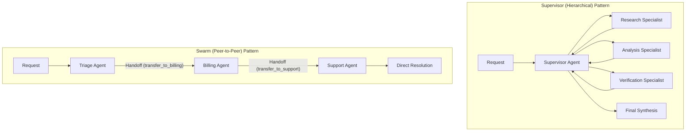
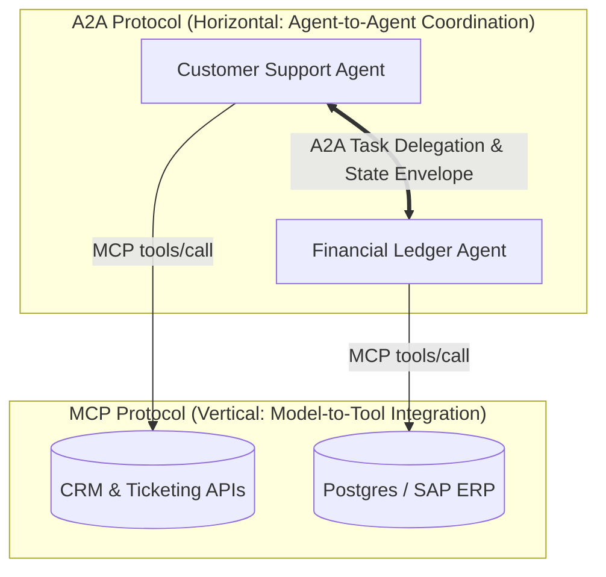

# Enterprise Use Case 6: Agent-to-Agent (A2A) Protocols & Swarm Orchestration

> [🔙 Back to Senior Transition Guide](../senior-transition-guide.md)

---

## Architectural Context
Complex enterprise tasks spanning distinct business domains (finance, legal, engineering, customer operations) require decomposing responsibilities across specialized, interoperable agents using standardized communication protocols.



---

## Orchestration Pattern Comparison

| Dimension | Supervisor (Hierarchical) | Swarm (Peer-to-Peer Handoff) |
|:---|:---|:---|
| **Control Flow** | Central coordinator delegates subtasks and reviews outputs. | Active agent transfers execution control directly to a peer. |
| **Best Used For** | Multi-step research, cross-checking, centralized audit logging. | Customer operations triage, sequential domain transfers. |
| **State Management** | Centralized state store; workers return state diffs. | Context passed via handoff payloads across agents. |
| **Failure Profile** | Single point of failure at supervisor; easily monitored. | Risk of ping-pong handoff loops; requires loop caps. |

---

---

## 🏛️ The Protocol Duality: MCP (Vertical) vs. A2A (Horizontal)

In production enterprise multi-agent architectures, two complementary standards govern system interactions:



| Dimension | Model Context Protocol (MCP 2026) | Agent2Agent Protocol (A2A) |
|:---|:---|:---|
| **Architectural Vector** | **Vertical**: Connects an AI model to local/remote tools, files, and databases. | **Horizontal**: Connects independent autonomous agents to coordinate multi-step workflows. |
| **Origin & Governance** | Anthropic $\to$ Donated to **Agentic AI Foundation** (Linux Foundation). | Google $\to$ Supported by **Agentic AI Foundation** (Google, MSFT, OpenAI, Anthropic, AWS). |
| **Primary Interaction** | Request/Response tool execution (`tools/call`, `resources/read`). | Task negotiation, capability discovery, state handoffs, and collaborative sub-goals. |
| **Discovery Mechanism** | Server capability negotiation (`tools/list`, `resources/list`) with `ttlMs`. | **Agent Capability Cards** declaring domain competencies, auth scopes, and SLA bounds. |

---

## 📜 A2A Capability Card & Discovery Manifest

Each autonomous enterprise agent publishes an immutable discovery manifest allowing peers to discover its abilities dynamically:

```json
{
  "$schema": "https://a2a-protocol.org/schemas/v1/capability-card.json",
  "agent_id": "agent-financial-ledger-prod",
  "name": "Enterprise Financial Ledger Specialist",
  "version": "1.4.0",
  "description": "Performs accounting reconciliation, invoice adjustments, and transaction queries.",
  "organization": "finance.corp.internal",
  "security": {
    "auth_protocol": "mTLS_Bearer_JWT",
    "accepted_issuers": ["https://auth.corp.internal/v1"],
    "required_scopes": ["finance:read", "invoice:credit:request"]
  },
  "supported_tasks": [
    {
      "task_type": "invoice_reconciliation",
      "input_schema": {
        "type": "object",
        "properties": {
          "invoice_id": { "type": "string" },
          "disputed_amount": { "type": "number" }
        },
        "required": ["invoice_id", "disputed_amount"]
      },
      "max_execution_time_seconds": 60,
      "requires_human_signoff": true
    }
  ]
}
```

---

## 🛡️ Bounded Delegation & Saga Rollbacks

When Agent A delegates to Agent B over A2A:
1. **Identity & Scope Downgrading**: Agent B executes strictly under the least-privileged intersection of Agent A's credentials and the required task scope.
2. **Deterministic Step Limits**: The delegation envelope carries a non-resettable iteration counter (`max_hops: 4`) preventing circular ping-pong loops between agents.
3. **Compensating Transactions (Saga Pattern)**: If a multi-agent workflow fails 3 agents deep, the orchestrator issues reversing commands in inverse chronological order.
