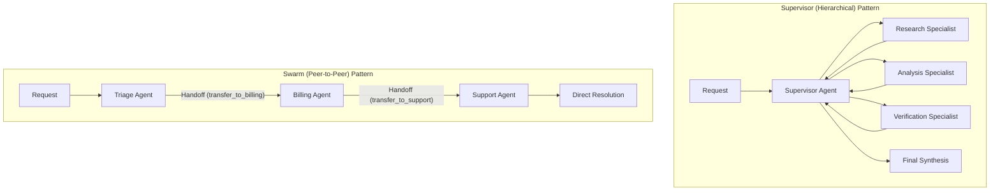

# Enterprise Use Case 6: Agent-to-Agent (A2A) Protocols & Swarm Orchestration

> [🔙 Back to Senior Transition Guide](../senior-transition-guide.md)

---

## Architectural Context
Complex enterprise tasks spanning distinct business domains (finance, legal, engineering, customer operations) require decomposing responsibilities across specialized, interoperable agents using standardized communication protocols.

---

## Orchestration Pattern Comparison

| Dimension | Supervisor (Hierarchical) | Swarm (Peer-to-Peer Handoff) |
|:---|:---|:---|
| **Control Flow** | Central coordinator delegates subtasks and reviews outputs. | Active agent transfers execution control directly to a peer. |
| **Best Used For** | Multi-step research, cross-checking, centralized audit logging. | Customer operations triage, sequential domain transfers. |
| **State Management** | Centralized state store; workers return state diffs. | Context passed via handoff payloads across agents. |
| **Failure Profile** | Single point of failure at supervisor; easily monitored. | Risk of ping-pong handoff loops; requires loop caps. |

---

## Architectural Standards for A2A
- **Standardized Message Payloads**: Use JSON-RPC 2.0 or CloudEvents schemas containing sender ID, recipient ID, session token, and authorized scopes.
- **Asynchronous Message Brokering**: Long-running background agent tasks communicate via durable queues (Kafka, RabbitMQ, Redis Streams).
- **Consensus Mechanisms**: Critical operations use majority voting or multi-agent debate across diverse models before committing state changes.
